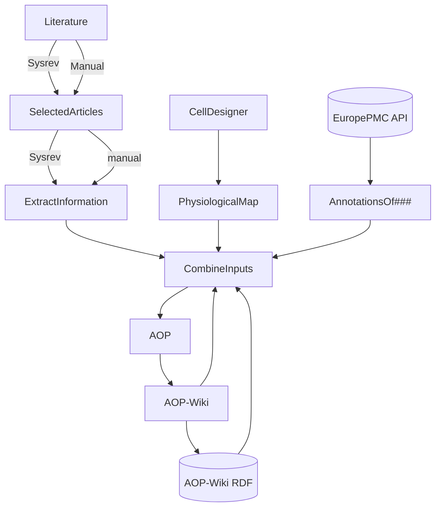

# AOP Literature study towards an AOP

```mermaid
graph TD
    Literature-->|Sysrev|SelectedArticles
    Literature-->|Manual|SelectedArticles
    SelectedArticles-->|Sysrev|ExtractInformation
    SelectedArticles-->|manual|ExtractInformation
    ExtractInformation-->CombineInputs
    CombineInputs --> AOP 
    AOP-->AOP-Wiki 
    AOP-Wiki-->AOP-WikiRDF[(AOP-Wiki RDF)]
    PhysiologicalMap-->CombineInputs
    EuropePMCAPI[(EuropePMC API)]-->AnnotationsOf###-->CombineInputs
    AOP-Wiki-->CombineInputs
    AOP-WikiRDF[(AOP-Wiki RDF)]-->CombineInputs
    CellDesigner-->PhysiologicalMap
```

```mermaid
flowchart TD
    
```
